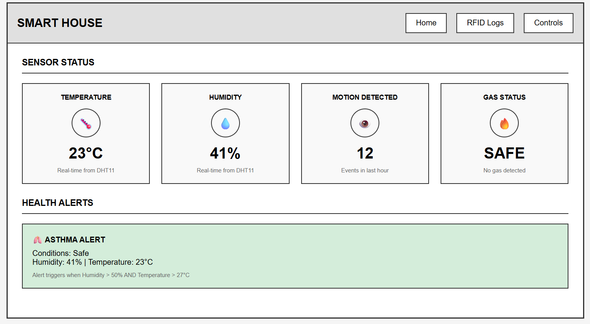
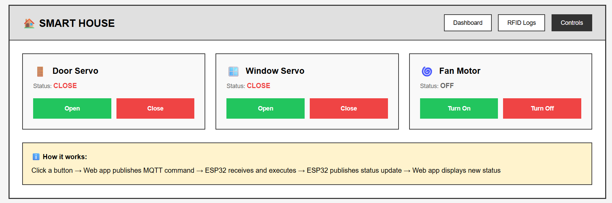
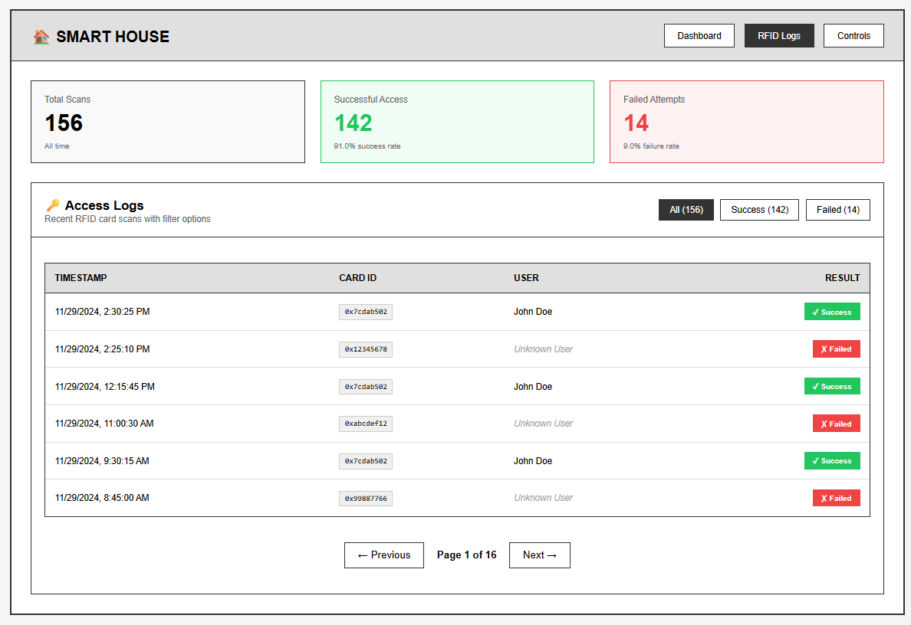

# Smart House Dashboard - Quick Start Guide

**Visual Guide for New Users**

**Live Dashboard:** https://gregarious-semifreddo-257864.netlify.app/

---

## Table of Contents
1. [Dashboard Home](#1-dashboard-home)
2. [Device Controls](#2-device-controls)
3. [RFID Access Logs](#3-rfid-access-logs)

---

## 1. Dashboard Home

**Access:** Click "Home" or "Dashboard" in the navigation menu

### What You'll See:



### Four Main Sensor Cards:

#### 🌡️ Temperature
- **Current Reading:** 23°C (example)
- **Updates:** Every 15 minutes
- **Source:** DHT11 sensor on ESP32

#### 💧 Humidity
- **Current Reading:** 41% (example)
- **Updates:** Every 15 minutes
- **Source:** DHT11 sensor on ESP32

#### 🚶 Motion Detected
- **Current Count:** 12 events (example)
- **Time Period:** Last hour only
- **Resets:** Automatically every hour

#### 🔥 Gas Status
- **Normal:** "SAFE - No gas detected" (green)
- **Alert:** "GAS DETECTED!" (red warning)
- **Auto Action:** Fan activates when gas detected

### Health Alerts Section:

#### 🫁 Asthma Alert Banner
- **Shows When:** Humidity > 50% AND Temperature > 27°C
- **Displays:** Current conditions and warning message
- **Hidden When:** Conditions are safe

---

## 2. Device Controls

**Access:** Click "Controls" in the navigation menu

### What You'll See:



### Three Control Cards:

#### 🚪 Door Servo
- **Status Display:** "CLOSE" (red) or "OPEN" (green)
- **Controls:**
  - Green "Open" button → Opens door
  - Red "Close" button → Closes door
- **Auto-Operation:** Opens for 3 seconds when authorized RFID scanned

#### 🪟 Window Servo
- **Status Display:** "CLOSE" (red) or "OPEN" (green)
- **Controls:**
  - Green "Open" button → Opens window
  - Red "Close" button → Closes window
- **Auto-Operation:** Closes automatically when steam/moisture detected

#### 🌀 Fan Motor
- **Status Display:** "OFF" (gray) or "ON" (green)
- **Controls:**
  - Green "Turn On" button → Starts fan
  - Red "Turn Off" button → Stops fan
- **Auto-Operation:** Turns on automatically when gas detected

### How It Works:
```
1. Click button
   ↓
2. Web app sends MQTT command
   ↓
3. ESP32 receives and executes
   ↓
4. ESP32 sends status update
   ↓
5. Dashboard shows new status
```

**Response Time:** 1-2 seconds

---

## 3. RFID Access Logs

**Access:** Click "RFID Logs" in the navigation menu

### What You'll See:



### Statistics Cards (Top Row):

#### Total Scans
- **Shows:** All RFID card scan attempts
- **Example:** 156 total scans

#### Successful Access
- **Shows:** Authorized cards only
- **Example:** 142 successful (91.0% success rate)
- **Color:** Green background

#### Failed Attempts
- **Shows:** Unauthorized cards only
- **Example:** 14 failed (9.0% failure rate)
- **Color:** Red background

### Access Logs Table:

#### Filter Buttons
- **All (156)** - Shows every scan
- **Success (142)** - Authorized only
- **Failed (14)** - Unauthorized only

#### Table Columns:
1. **TIMESTAMP** - When the card was scanned
2. **CARD ID** - Unique card identifier (e.g., 0x7cdab502)
3. **USER** - Name if registered, "Unknown User" if not
4. **RESULT** - "✓ Success" (green) or "✗ Failed" (red)

#### Example Entries:
```
11/29/2024, 2:30:25 PM  |  0x7cdab502  |  John Doe      |  ✓ Success
11/29/2024, 2:25:10 PM  |  0x12345678  |  Unknown User  |  ✗ Failed
11/29/2024, 12:15:45 PM |  0x7cdab502  |  John Doe      |  ✓ Success
```

#### Pagination:
- **← Previous** - View older entries
- **Page 1 of 16** - Current page indicator
- **Next →** - View newer entries

### Real-Time Updates:
- New scans appear automatically
- Statistics update instantly
- No page refresh needed

---

## Common Tasks

### View Current Temperature
1. Go to **Dashboard** page
2. Look at **Temperature** card (top-left)
3. Reading updates every 15 minutes

### Open Door Remotely
1. Go to **Controls** page
2. Find **Door Servo** card (left)
3. Click green **"Open"** button
4. Wait 1-2 seconds for status to change

### Check Who Accessed Today
1. Go to **RFID Logs** page
2. Click **"Success (142)"** filter button
3. View table sorted by most recent first
4. Look for today's date entries

### Monitor Gas Alert
1. Go to **Dashboard** page
2. Look at **Gas Status** card (bottom-right)
3. If "GAS DETECTED!" appears:
   - Red warning badge shows
   - Fan automatically turns on
   - Check physical environment

### Check Asthma Conditions
1. Go to **Dashboard** page
2. Scroll to **Health Alerts** section
3. If alert is visible:
   - Both conditions are met (high humidity + high temp)
   - Take appropriate action
4. If hidden:
   - Conditions are safe

---

## Visual Status Indicators

### Color Codes:
- 🟢 **Green** = Safe / Normal / Open / On / Success
- 🔴 **Red** = Alert / Warning / Closed / Off / Failed
- ⚪ **Gray** = Inactive / Off
- 🟡 **Yellow/Beige** = Information box

### Icon Meanings:
- 🌡️ Temperature sensor
- 💧 Humidity/water
- 🚶 Motion/movement
- 🔥 Gas/fire detection
- 🫁 Health/asthma
- 🚪 Door
- 🪟 Window
- 🌀 Fan/ventilation
- 🔑 RFID/access control

---

## Navigation Tips

### Top Navigation Bar:
```
SMART HOUSE    [Dashboard] [RFID Logs] [Controls]
```

- Click any button to switch pages
- Current page is highlighted (dark background)
- Navigation always visible

### Mobile View:
- Cards stack vertically on small screens
- All features remain accessible
- Scroll to see all content

---

## Troubleshooting Quick Fixes

| Problem | Quick Fix |
|---------|-----------|
| No data showing | Refresh page, check ESP32 is powered on |
| Data not updating | Check internet connection |
| Controls not working | Wait 3 seconds, try again |
| RFID scans missing | Check database connection, refresh page |

---

## Additional Resources

- **Full User Manual:** [WEB_APP_USER_MANUAL.md](WEB_APP_USER_MANUAL.md)
- **Project Guide:** [PROJECT_GUIDE.md](PROJECT_GUIDE.md)
- **System Architecture:** [ARCHITECTURE.md](ARCHITECTURE.md)

---

**Quick Start Complete!** You're now ready to use the Smart House Dashboard.

For detailed explanations of each feature, refer to the complete [User Manual](WEB_APP_USER_MANUAL.md).
